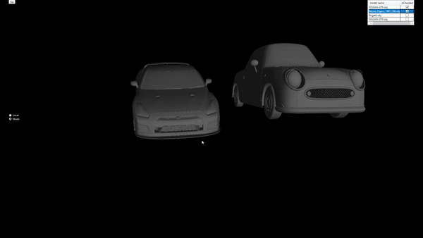

# 3DViewer v2.0

  

## Contents

1. [3DViewer v2.0](#3dviewer2.0)
    
## 3DViewer2.0

- Программа разработана на языке C# в соответствии с принципами ООП и SOLID
- Для работы с графикой используется OpenTK.
    - Каждая модель представлена отдельным VAO
    - Обработка смещений, вращений и света производиться в шейдерах на языке GLSL.
   
- Программа предоставляет возможности:
    - Загружать модель из файла формата obj.
    - Перемещать модель на заданное расстояние относительно осей X, Y, Z.
    - Поворачивать модель на заданный угол относительно своих осей X, Y, Z
    - Масштабировать модель на заданное значение.
- Всё операции описанные выше доступны для локальной и глобальной систем координат

- В программе реализован графический пользовательский интерфейс с использованием mvvm архитектуры на базе технологии wpf 
- Графический пользовательский интерфейс содержит:
    - Кнопку для выбора файла с моделью и поле для вывода его названия.
    - Зону визуализации  модели.
    - Поля ввода для перемещения модели. 
    - Поля ввода для поворота модели. 
    - Поле ввода для масштабирования модели.  
    - Поле ввода для переключения режима взаимодействия с моделью (локальная и глобальная система координат и "камера")
    - Поля ввода для выбора моделей, с которыми будет взаимодействовать пользователь (от 0 до 20 моделей единовременно)
    - Информацию о загруженной модели - название файла
- Программа корректно обрабатывает и позволяет пользователю просматривать модели с деталями до 100, 1000, 10 000, 100 000, 1 000 000 вершин без зависания
- Программа корректоно обрабатывает до 20 моделей на экране единовременно
